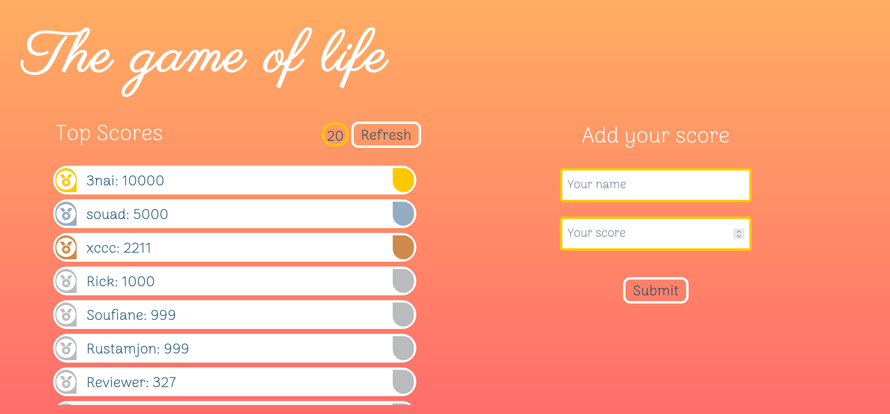

# LeaderBoard

> **Leaderboard** is website that displays the scores submitted by all players. It also allows the current user to submit his/her score. All data is preserved thanks to the external Leaderboard API service.

## Built With

- 
- 
- 
- 

## Milestones

- [x] Milestone 1: **Project Structure**
- [x] Milestone 2: **Send and receive data from API.**
- [x] Milestone 3: **Final touches.**

## sneak peek

## Getting Started

**Prerequisites:** A Web Browser (preferably FireFox or Chrome)

### **Option 1**

#### Use the live Website

[Leaderboard Website](https://sboursen.github.io/Leaderboard/)

### **Option 2**

#### Set up your own copy locally

- Clone [the GitHub Repository](https://github.com/Sboursen/Leaderboard)
- Go to the Project `cd Leaderboard`
- Run `npm install` to install the _dependencies_
  \_ Run `npm run start` to run the live server.

## About me

👤 **Soufiane Boursen**

- GitHub: [@Sboursen](https://github.com/Sboursen)
- Twitter: [@sboursen_dev](https://twitter.com/sboursen_dev)
- LinkedIn: [@sboursen](https://linkedin.com/in/sboursen)

## Contributors

Contributions, issues, and feature requests are welcome!

Feel free to check the [issues page](../../issues/).

## Show your support

Give a ⭐️ if you like this project!

## Acknowledgments

- <a href="https://iconscout.com/icons/leaderboard" target="_blank">Leaderboard Icon</a> by <a href="https://iconscout.com/contributors/story-bell">Story Bell</a> on <a href="https://iconscout.com">Iconscout</a>

## 📝 License

This project is [MIT](./MIT.md) licensed.
